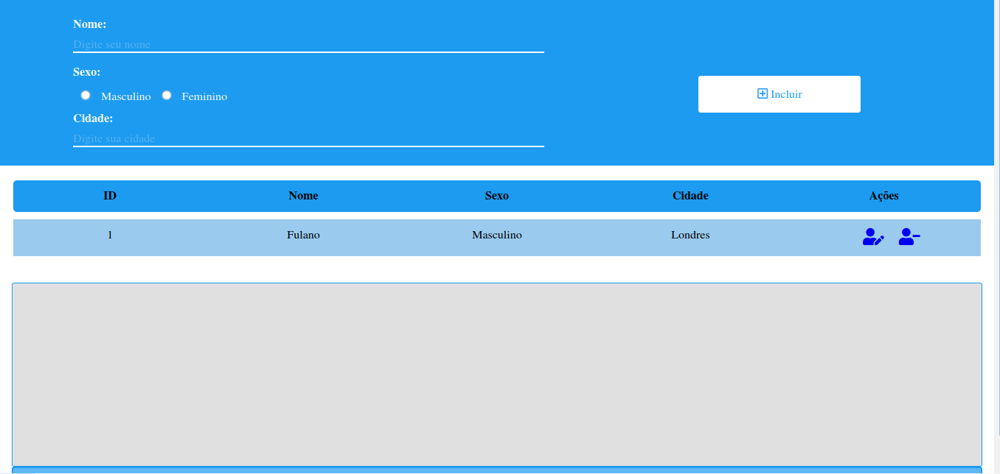

# CRUD - Node.js

## Tabela de Conteúdo
- [Overview](#overview)
  - [Screenshot](#screenshot) 
- [Documentação](#documentação)
  - [Instalação](#instalação)
  - [Rotas](#rotas)
  - [Request](#request)
    - [GET](#get)
    - [POST](#post)
    - [PUT](#put)
    - [DELETE](#delete)
  - [Response](#response)
    - [GET](#get)
    - [GET:id](#get:id)
    - [POST](#post)
    - [PUT](#put)
    - [DELETE](#delete)

## Overview
Usuário pode:
<ul>
  <li>Realizar CRUD pelas rotas da API (GET, POST, PUT, DELETE)</li>
  <li>Acessar a aplicação por uma página HTML (index) que consome as rotas da API</li>
  <li>Realizar CRUD pelas através da View (index)</li>
  <li>Persistir dados em um banco de dados (SQLite)</li>
</ul>

## Screenshot



## Documentação

### Instalação

Após clonar o repositório, abra o terminal dentro diretório do projeto e eecute o comando abaixo para baixar as dependências necessárias

```javascript
npm install
```
Execute

```javascript
npm start
```
Ou

```javascript
node server.js
```

### Rotas

Rotas existentes para essa API:
| Método| Rota |Descrição|
|------|-------|---------|
| GET  |`/` | Renderiza a página HTML da aplicação
| GET  |`/pessoa`| Retorna dados em formato JSON de todas as pessoas cadastradas |
| GET  |`/pessoa/:id`| Retorna uma pessoa especifica com base no parametro "id" em formato JSON |
| POST |`/pessoa` | Enviar os dados para ser persistido no banco de dados através do corpo da requisição |
| PUT |`/pessoa` |  Altera um pessoa já cadastrado com base nos dados passados no corpo da requisição |
| DELETE |`/pessoa` | Delete uma pessoa com base em seu ID que é passado no corpo da requisição |

### Request

#### GET

```json
{
}
```


#### POST

```json
{
  "nome": "Fulano",
  "sexo": "Masculino",
  "cidade": "Nova York"
}
```

#### PUT

```json
{
  "id": 2,
  "nome": "Ciclana",
  "sexo": "Feminino",
  "cidade": "Paris"
}
```

#### DELETE

```json
{
  "id": 2
}
```
### Response

#### GET

  Exemplo:
    ```localhost:3000/pessoa```
   
  
```json
{
  "quantidade": 2,
  "pessoas": [
    {
      "id": 1,
      "nome": "Fulano",
      "sexo": "Masculino",
      "cidade": "Nova York",
      "request": {
        "tipo": "GET",
        "descricao": "Retona todas as pessoas",
        "url": "http://localhost:3000/pessoas/1"
      }
    },
    {
      "id": 2,
      "nome": "Beltrano",
      "sexo": "Masculino",
      "cidade": "Londres",
      "request": {
        "tipo": "GET",
        "descricao": "Retona todas as pessoas",
        "url": "http://localhost:3000/pessoas/2"
      }
    }
  ]
}
```
#### GET:id

Exemplo:
  ```localhost:3000/pessoa/2```
  
  ```json
  {
      "id": 2,
      "nome": "Beltrano",
      "sexo": "Masculino",
      "cidade": "Londres",
      "request": {
        "tipo": "GET",
        "descricao": "Retona todas as pessoas",
        "url": "http://localhost:3000/pessoas/2"
      }
    }
   ```
 

#### POST

Exemplo:
  ```localhost:3000/pessoa```


```json
{
  "mensagem": "Pessoa inserido com sucesso",
  "usuarioCriado": {
    "nome": "Fulano",
    "sexo": "Masculino",
    "cidade": "Nova York",
    "request": {
      "tipo": "GET",
      "descricao": "Retorna detalhes de todas as pessoas",
      "url": "http://localhost:3000/pessoas/"
    }
  }
}
```

#### PUT

Exemplo: 
      ```localhost:3000/pessoa```
      
```
{
  "mensagem": "Pessoa atualizada com sucesso",
  "usuarioCriado": {
    "id": 2,
    "nome": "Ciclana",
    "sexo": "Feminino",
    "cidade": "Paris",
    "request": {
      "tipo": "GET",
      "descricao": "Retorna detalhes de uma pessoa especifica",
      "url": "http://localhost:3000/pessoas/9"
    }
  }
}
```
#### DELETE

Exemplo: 
      ```localhost:3000/pessoa```
      
```
{
  "mensagem": "Pessoa removida com sucesso",
  "request": {
    "tipo": "GET",
    "descricao": "Retona todas as pessoas",
    "url": "http://localhost:3000/pessoas/"
  }
}
```
